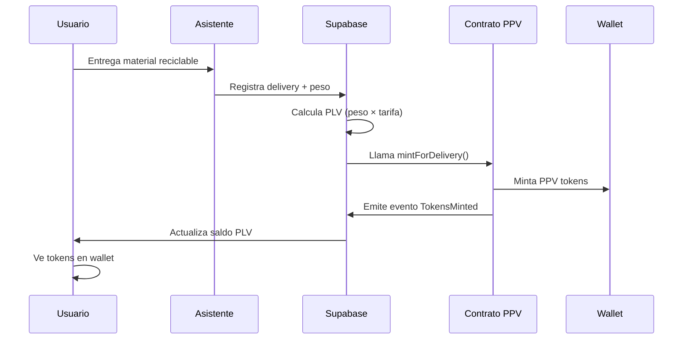

# AMBITECAPP

Aplicación web en Next.js para gestionar reciclaje en puntos físicos (ambitecas) con integración completa de tokens PerlaVerde (PPV) usando Privy y contratos inteligentes.

## 🌟 Características

- **Sistema de Reciclaje**: Registro de materiales y pesaje en ambitecas
- **Tokens PPV**: Minting automático de tokens PerlaVerde por reciclaje
- **Wallets Embebidas**: Integración con Privy para wallets sin fricción
- **Contratos Upgradeable**: Patrón UUPS proxy para actualizaciones seguras
- **Multi-Chain**: Soporte para Base y Optimism (testnet y mainnet)

## 👥 Tipos de Usuario

- **Administrador**: Gestión del sistema con panel de control
- **Asistente**: Operación diaria en ambitecas, registro de entregas
- **Ciudadano**: Reciclaje y gestión de tokens PPV

## 🛣️ Rutas Principales

### Landing y Navegación
- `/` Landing con accesos a los roles
- `/dashboard` Panel para Administrador
- `/onboarding` Pantalla de onboarding

### Flujo del Asistente
- `/assistant` Inicio del flujo (selección de ambiteca)
  - `/assistant/home` ¿Qué quieres hacer hoy?
  - `/assistant/login` Identificar persona
  - `/assistant/register` Registrar persona nueva
  - `/assistant/materials` Selección de material
  - `/assistant/scale` Indicación de llevar a báscula
  - `/assistant/weight` Ingreso de peso
- `/assistant/summary` **Resumen y minting de PPV** 🪙
  - `/assistant/more` ¿Pesar más materiales?
  - `/assistant/receipt` Recibo/agradecimiento
- `/assistant/history` Históricos (material/persona)
- `/assistant/rewards` **Gestión de tokens PPV** 💰

## 🚀 Instalación y Configuración

### 1. Instalar Dependencias
```bash
npm install
```

### 2. Configurar Variables de Entorno
Copia `env.example` a `.env.local` y configura:

```bash
# Privy (requerido para wallets)
NEXT_PUBLIC_PRIVY_APP_ID=tu_privy_app_id
PRIVY_APP_SECRET=tu_privy_app_secret
PRIVY_WEBHOOK_SECRET=tu_privy_webhook_secret

# Supabase (requerido para base de datos)
NEXT_PUBLIC_SUPABASE_URL=https://tu-proyecto.supabase.co
NEXT_PUBLIC_SUPABASE_PUBLISHABLE_KEY=tu_supabase_anon_key
SUPABASE_SERVICE_ROLE_KEY=tu_supabase_service_role_key

# Contratos PerlaVerde (configurar después del deployment)
NEXT_PUBLIC_PPV_PROXY_BASE_SEPOLIA=0x...
NEXT_PUBLIC_PPV_PROXY_OP_SEPOLIA=0x...
```

### 3. Configurar Webhooks Privy → Supabase
Para sincronización automática de usuarios, sigue la guía: [`docs/privy-webhooks-setup.md`](docs/privy-webhooks-setup.md)

### 4. Ejecutar la Aplicación
```bash
npm run dev
```

Abrir `http://localhost:3000`.

## 🔗 Integración con Contratos

### Desplegar Contratos
Los contratos están en el repositorio `/Users/atomauro/ambiteca/ambiteca-contracts`:

```bash
cd /Users/atomauro/ambiteca/ambiteca-contracts

# Configurar variables
export PRIVATE_KEY=0x...
export OWNER_ADDRESS=0x...

# Desplegar en Base Sepolia
forge script script/Deploy.s.sol:Deploy \
  --rpc-url https://sepolia.base.org \
  --broadcast --verify -vvvv

# Configurar ambitecas
export PROXY_ADDRESS=0x... # Dirección del proxy desplegado
forge script script/Deploy.s.sol:Setup \
  --rpc-url https://sepolia.base.org \
  --broadcast -vvvv
```

### Configurar Direcciones
Actualiza `.env.local` con las direcciones de los contratos desplegados.

## 🪙 Flujo de Tokens PPV

### 1. Usuario Recicla


### 2. Gestión de Tokens
- **Balance en Tiempo Real**: Se muestra en todas las páginas del asistente
- **Transferencias**: Los usuarios pueden enviar PPV a otras direcciones
- **Historial**: Tracking completo de transacciones
- **Multi-Chain**: Soporte para Base y Optimism

## 🏗️ Arquitectura Técnica

### Frontend (Next.js + Privy)
- **Hooks Personalizados**: `usePerlaVerde()` para interacción con contratos
- **Componentes**: `PerlaVerdeBalance`, `AssistantHeader`
- **Cliente de Contratos**: Abstracción completa con ethers.js

### Contratos (Foundry + OpenZeppelin)
- **PerlaVerdeV1**: Token ERC20 upgradeable con roles
- **Patrón UUPS**: Upgrades seguros sin cambiar dirección
- **Roles Granulares**: MINTER, BRIDGE, AMBITECA, UPGRADER

### Base de Datos (Supabase)
- **Esquema PLV**: Wallets, transacciones, balances
- **Sincronización**: Eventos blockchain → base de datos
- **RLS**: Políticas de seguridad por rol

## 🔐 Seguridad

- **Wallets Embebidas**: Privy maneja claves privadas de forma segura
- **Roles de Contrato**: Control granular de permisos
- **Upgrades Controlados**: Solo UPGRADER_ROLE puede actualizar
- **Pausabilidad**: Control de emergencia para transferencias

## 📁 Estructura del Proyecto

```
├── components/
│   ├── AssistantHeader.tsx      # Header con balance PPV
│   ├── PerlaVerdeBalance.tsx    # Componente de balance
│   └── Providers.tsx            # Configuración Privy
├── lib/
│   ├── contracts/
│   │   ├── client.ts            # Cliente de contratos
│   │   ├── config.ts            # Configuración multi-chain
│   │   └── abi.ts               # ABI del contrato
│   └── hooks/
│       └── usePerlaVerde.ts     # Hook principal
├── pages/
│   ├── assistant/
│   │   ├── summary.tsx          # ✨ Minting automático
│   │   └── rewards.tsx          # ✨ Gestión de PPV
│   └── api/
│       └── plv/
│           └── withdraw.ts      # API integrada con Privy
└── supabase/
    └── migrations/              # Esquema de base de datos
```

## 🧪 Testing

```bash
# Frontend
npm run lint
npm run build

# Contratos
cd /Users/atomauro/ambiteca/ambiteca-contracts
forge test
forge test -vvv  # Logs detallados
```

## 🚀 Deployment

### Frontend (Vercel)
1. Conectar repositorio a Vercel
2. Configurar variables de entorno
3. Deploy automático

### Contratos
Ver documentación completa en `/Users/atomauro/ambiteca/ambiteca-contracts/README.md`

## 📚 Documentación Adicional

- **Contratos**: `/Users/atomauro/ambiteca/ambiteca-contracts/README.md`
- **Base de Datos**: `docs/data-model.md`
- **Arquitectura**: `docs/supabase-privy-flow.md`

## 🤝 Contribuir

1. Fork el proyecto
2. Crear rama feature (`git checkout -b feature/nueva-funcionalidad`)
3. Commit cambios (`git commit -am 'Agregar nueva funcionalidad'`)
4. Push a la rama (`git push origin feature/nueva-funcionalidad`)
5. Crear Pull Request

## 📄 Licencia

Ver archivo `LICENSE`.
