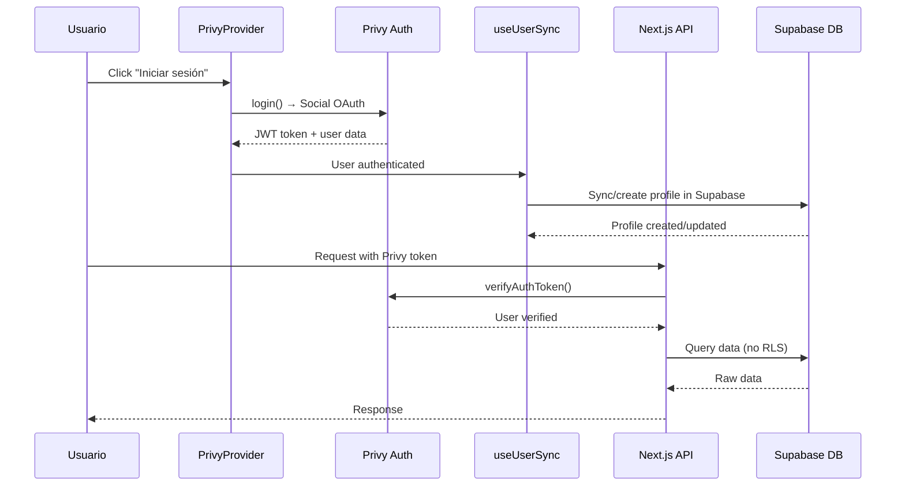

# Nueva Arquitectura: Privy Auth + Supabase DB

## Cambio de Estrategia

**Antes**: Supabase Auth + Privy Custom Auth (costoso)  
**Ahora**: Privy Auth + Supabase como DB únicamente (cost-effective)

## Arquitectura Simplificada

```mermaid
graph TD
    %% Cliente y UI
    subgraph "🖥️ Cliente (Next.js App)"
        A[Usuario hace login social]
        B[PrivyProvider<br/>- Social logins<br/>- Embedded wallets]
        C[useUserSync Hook<br/>- Sincroniza Privy → Supabase]
        D[UI Components<br/>- Dashboard<br/>- Admin/Assistant flows]
        
        A --> B
        B --> C
        C --> D
    end

    %% Autenticación
    subgraph "🔐 Autenticación (Solo Privy)"
        E[Privy Auth<br/>- Google, Apple, Facebook<br/>- Email/Password<br/>- JWT tokens]
        F[PrivyClient Server<br/>- Token verification<br/>- User data]
        
        E --> F
    end

    %% Backend y Base de Datos
    subgraph "🗄️ Backend (Supabase DB)"
        G[Next.js API Routes<br/>- withAuth middleware<br/>- withAdminAuth middleware]
        H[Supabase Client<br/>- Solo para DB<br/>- Sin auth]
        I[(Postgres Database<br/>- Tabla profiles<br/>- PLV data<br/>- Sin RLS auth)]
        
        G --> H
        H --> I
    end

    %% Wallet Management
    subgraph "💰 Gestión de Wallets"
        J[Privy Embedded Wallets<br/>- Auto-creación<br/>- Firma de transacciones]
        K[Smart Contracts<br/>- PerlaVerde (PPV) ERC20<br/>- Base/OP Sepolia]
        
        J --> K
    end

    %% Flujos de datos
    A -->|"login() con social"| E
    B -->|"user data"| C
    C -->|"sync profile to Supabase"| H
    D -->|"fetch() con Privy token"| G
    F -->|"verifyAuthToken()"| G
    
    %% Estados de sesión
    E -->|"JWT token en cookies"| B
    B -->|"authenticated user + wallet"| J

    %% Estilos
    classDef clientBox fill:#e1f5fe
    classDef authBox fill:#fff3e0
    classDef backendBox fill:#f3e5f5
    classDef walletBox fill:#e8f5e8
    
    class A,B,C,D clientBox
    class E,F authBox
    class G,H,I backendBox
    class J,K walletBox
```

## Flujo de Autenticación Simplificado



## Componentes Clave Actualizados

### 1. **Providers.tsx** - Simplificado
```typescript
<PrivyProvider
  appId={process.env.NEXT_PUBLIC_PRIVY_APP_ID}
  config={{
    loginMethods: ['google', 'apple', 'facebook', 'email'],
    embeddedWallets: { createOnLogin: 'all-users' },
    appearance: { accentColor: '#10b981' }
  }}
>
  {children}
</PrivyProvider>
```

### 2. **useUserSync.ts** - Sincronización automática
- Detecta login de Privy
- Crea/actualiza perfil en Supabase
- Mantiene datos sincronizados

### 3. **privy-server.ts** - Middleware de autenticación
- `verifyPrivyToken()` - Valida tokens
- `withAuth()` - Protege rutas API
- `withAdminAuth()` - Protege rutas admin

### 4. **useAdminGuard.ts** - Protección de rutas
- Verifica autenticación + rol admin
- Maneja redirecciones automáticas
- Estados de carga

## Beneficios de la Nueva Arquitectura

✅ **Costo reducido**: Sin Supabase Auth  
✅ **Simplicidad**: Un solo proveedor de auth  
✅ **Flexibilidad**: Privy maneja social + wallets  
✅ **Escalabilidad**: Supabase solo para datos  
✅ **Mantenimiento**: Menos complejidad  

## Variables de Entorno Necesarias

```env
# Privy (Principal)
NEXT_PUBLIC_PRIVY_APP_ID=clp...
PRIVY_APP_SECRET=...

# Supabase (Solo DB)
NEXT_PUBLIC_SUPABASE_URL=https://PROJECT_ID.supabase.co
NEXT_PUBLIC_SUPABASE_PUBLISHABLE_KEY=eyJ...
```

## Migración Completada

### ✅ **Eliminado**:
- `SupabaseProvider.tsx`
- `pages/auth/login.tsx`
- `pages/auth/register.tsx`
- `getServerSideProps` con Supabase Auth
- Custom auth configuration

### ✅ **Actualizado**:
- `Providers.tsx` → Solo PrivyProvider
- `pages/index.tsx` → Botón login directo
- `pages/dashboard.tsx` → useUserSync
- API routes → withAuth middleware
- Admin pages → useAdminGuard

### ✅ **Creado**:
- `useUserSync.ts` - Sincronización Privy ↔ Supabase
- `privy-server.ts` - Server-side auth
- `useAdminGuard.ts` - Client-side protection

## Estado Actual

🟢 **Listo para producción** con autenticación social completa y gestión de wallets integrada.


