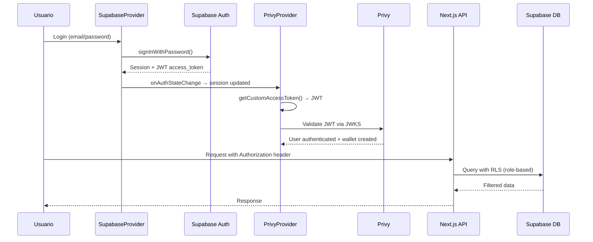

# Diagrama de Flujo: Supabase + Privy Custom Auth

## Arquitectura de Autenticación Híbrida

```mermaid
graph TD
    %% Usuario y UI
    subgraph "🖥️ Cliente (Next.js App)"
        A[Usuario ingresa credenciales]
        B[SupabaseProvider<br/>- getSession()<br/>- onAuthStateChange()]
        C[PrivyProvider<br/>- customAuth config<br/>- getCustomAccessToken()]
        D[UI Components<br/>- Dashboard<br/>- Assistant/Admin flows]
        
        A --> B
        B --> C
        C --> D
    end

    %% Autenticación
    subgraph "🔐 Capa de Autenticación"
        E[Supabase Auth<br/>- JWT asimétrico<br/>- Email/Password<br/>- Social logins]
        F[JWKS Endpoint<br/>PROJECT_ID.supabase.co<br/>/auth/v1/.well-known/jwks.json]
        G[Privy Validation<br/>- Verifica JWT con JWKS<br/>- Maneja wallets]
        
        E --> F
        G --> F
    end

    %% Backend y Base de Datos
    subgraph "🗄️ Backend (Supabase)"
        H[Next.js API Routes<br/>/api/admin/*<br/>/api/deliveries/*<br/>/api/plv/*]
        I[createSupabaseServer()<br/>- SSR authentication<br/>- Server-side client]
        J[(Postgres Database<br/>- RLS policies activas<br/>- Roles: admin/assistant<br/>- PLV transactions)]
        
        H --> I
        I --> J
    end

    %% Wallet Management
    subgraph "💰 Gestión de Wallets"
        K[Privy Embedded Wallets<br/>- Auto-creación<br/>- Firma de transacciones]
        L[Smart Contracts<br/>- PerlaVerde (PPV) ERC20<br/>- Base/OP Sepolia]
        
        K --> L
    end

    %% Flujos de datos
    B -->|"signInWithPassword()"| E
    C -->|"getCustomAccessToken() retorna JWT"| G
    D -->|"fetch() con Authorization header"| H
    G -->|"Usuario autenticado + wallet"| K
    
    %% Estados de sesión
    E -->|"Session creada"| B
    B -->|"session.access_token"| C
    
    %% Protección de rutas
    I -->|"Verifica JWT + RLS"| J
    J -->|"Datos filtrados por rol"| H

    %% Estilos
    classDef clientBox fill:#e1f5fe
    classDef authBox fill:#fff3e0
    classDef backendBox fill:#f3e5f5
    classDef walletBox fill:#e8f5e8
    
    class A,B,C,D clientBox
    class E,F,G authBox
    class H,I,J backendBox
    class K,L walletBox
```

## Flujo de Autenticación Paso a Paso



## Componentes Clave

### 1. **SupabaseProvider** (`components/SupabaseProvider.tsx`)
- Maneja sesiones de Supabase
- Escucha cambios de autenticación
- Proporciona `supabase`, `session`, `user`, `loading`

### 2. **Providers** (`components/Providers.tsx`)
- Combina SupabaseProvider + PrivyProvider
- Configura `customAuth.getCustomAccessToken`
- Pasa JWT de Supabase a Privy

### 3. **Server-side Auth** (`lib/supabase/server.ts`)
- `createSupabaseServer()` para SSR
- Verifica tokens en API routes
- Aplica RLS automáticamente

## Beneficios de esta Arquitectura

✅ **Supabase**: Base de datos robusta + RLS + Auth social  
✅ **Privy**: Wallets embebidas + UX simplificada  
✅ **Seguridad**: JWT asimétrico + validación JWKS  
✅ **Escalabilidad**: Roles granulares + políticas RLS  
✅ **Web3**: Integración nativa con contratos inteligentes  

## Variables de Entorno Necesarias

```env
# Supabase
NEXT_PUBLIC_SUPABASE_URL=https://PROJECT_ID.supabase.co
NEXT_PUBLIC_SUPABASE_PUBLISHABLE_KEY=eyJ...

# Privy
NEXT_PUBLIC_PRIVY_APP_ID=clp...
```

---

**Referencia**: [Privy + Supabase Custom Auth Guide](https://docs.privy.io/recipes/authentication/using-supabase-for-custom-auth)


